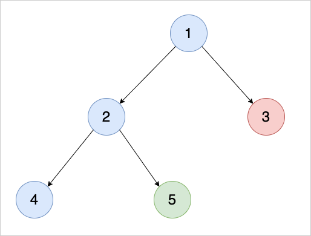

## Depth First Search
Depth First Search (DFS) algorithm is another way of traversing a graph. Unlike BFS where it explores all adjacent nodes first, DFS explores one node at a time to its deepest level.

For example, we have a tree-like graph like the below.



When we perform DFS, it'll continue exploring the node until it hits a leaf node. Then it continues with the neighbor node as it comes back up. The order visited nodes will be `1 2 4 5 3`. This ordering is actually equivalent to [preorder traversal](../../tree/preorder/).

## DFS Pseudocode
```text
dfs(graph, startingNode) → bool
    Pre: 'graph' is an adjacency list
         'startingNode' is a starting node to perform BFS
    Post: we've traversed a graph successfully :p

    S ← new Stack( startingNode )

    visited ← new Array( graph.vertices + 1 )
    visited[startingNode.value] ← true

    WHILE ( !S.empty() )
        V ← S.pop()
        print( V.value )

        FOR ( all neighbors U in V )
            IF ( visited[U.value] == false )
                visited[V.value] ← true
                S.push( U )
            END IF
        END FOR
    END WHILE

    return false
END dfs
```