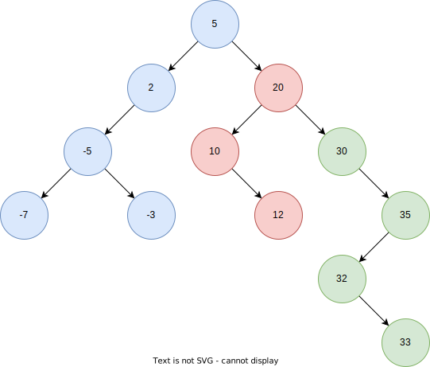

# Inorder Traversal



Inorder: `-7 -5 -3 2 5 10 12 20 30 32 33 35`

## Pseudocode

### Recursive

```text
inorder(node) → Node
    Pre: node is any arbitrary node in the list
    Post: we have traversed the list in inorder

    IF node == Ø
        RETURN
    END IF

    inorder(node.left)
    print node.value
    inorder(node.right)
END
```

### Iterative

```text
inorder(root) → void
    Pre: root is the root node of the tree
    Post: we have traversed the list in preorder

    IF node == Ø
        RETURN
    END IF

    stack ← new Stack
    curr  ← root

    WHILE (curr) OR (stack IS NOT empty)
        WHILE curr
            stack.push(curr)
            curr ← curr.left
        END WHILE

        curr ← stack.top
        stack.pop
        PRINT curr
        curr ← curr.right
    END WHILE
END
```

## Complexity

| Time | Space |
| :--: | :---: |
| O(V) | O(h)  |

- `V` - total number of vertices
- `h` - tree height

## Problem

- https://leetcode.com/problems/binary-tree-inorder-traversal/
