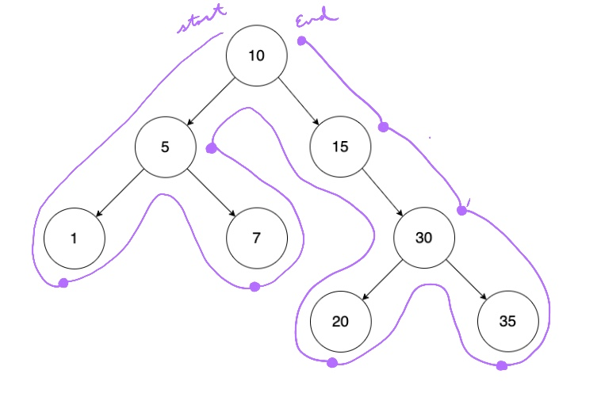

# Postorder Traversal



Postorder: `1 7 5 20 35 30 15 10`

## Pseudocode

### Recursive

```text
postorder(node) → Node
    Pre: node is any arbitrary node in the list
    Post: we have traversed the list in postorder

    IF (node == ø)
        return
    END IF

    postorder(node.left)
    postorder(node.right)
    print node.value
END
```

### Iterative

```text
postorder(root) → void
    Pre: root is the root node of the tree
    Post: we have traversed the list in preorder

    IF (node == ø)
        return
    END IF

    s1 ← new Stack
    s2 ← new Stack

    curr  ← root
    s1.push(curr)

    WHILE (!s1.empty)
        curr ← s1.top
        s1.pop

        s2.push(curr)

        IF (curr.left)
            s1.push(curr.left)
        ELSE IF (curr.right)
            s1.push(curr.right)
        END IF
    END WHILE

    WHILE (!s2.empty)
        curr ← s2.top
        print curr
    END WHILE
END
```

## Complexity

| Time | Space |
| :--: | :---: |
| O(V) | O(h)  |

- `V` - total number of vertices
- `h` - tree height

## Problem

- https://leetcode.com/problems/binary-tree-postorder-traversal/
