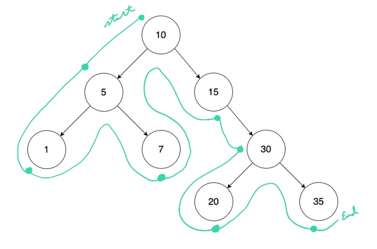

# Preorder Traversal



Preorder: `10 5 1 7 15 30 20 35`

## Pseudocode

### Recursive

```text
preorder(node) → Node
    Pre: node is any arbitrary node in the list
    Post: we have traversed the list in preorder

    IF (node == ø)
        return
    END IF

    print node.value
    preorder(node.left)
    preorder(node.right)
END
```

### Iterative

```text
preorder(root) → void
    Pre: root is the root node of the tree
    Post: we have traversed the list in preorder

    IF (node == ø)
        return
    END IF

    stack ← new Stack
    stack.push(root)

    WHILE (stack != empty)
        curr ← stack.top
        print curr
        stack.pop

        IF (curr.right)
            stack.push(curr.right)
        ELSE IF (curr.lfet)
            stack.push(curr.left)
        END
    END WHILE
END
```

## Complexity

| Time | Space |
| :--: | :---: |
| O(V) | O(h)  |

- `V` - total number of vertices
- `h` - tree height

## Problem

- https://leetcode.com/problems/binary-tree-preorder-traversal/
