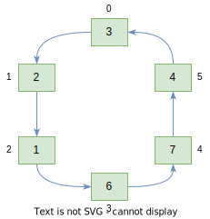

# Circular Queue

Circular Queue is a [queue](../queue-linked-list) where rear node is connected to the front node creating a circular list.



In programming, the term **enqueue** refers to adding an item to the queue and **dequeue** for removing an item from the queue.

|      | enqueue | dequeue | empty | front | rear |
| :--: | :-----: | :-----: | :---: | :---: | :--: |
| Time |  O(1)   |  O(1)   | O(1)  | O(1)  | O(1) |

## Pseudocode for Basic Operations

### enqueue

```text
enqueue(queue<T>, front, rear, value) → void
    Pre: queue is the queue array
         front references the first node in the queue
         rear references the last node in the queue
         value is the value we're going to enqueue
    Post: new element is added to the queue

    n ← new Node(value)

    IF (front == ø)
        front      ← n
        rear       ← n
        front.next ← rear
        rear.next  ← front
    ELSE
        n.next    ← front
        rear.next ← n
        rear      ← n
    END IF
END
```

### dequeue

```text
dequeue(queue<T>, front, rear) → Node<T>
    Pre: queue is the queue array
         front references the first node in the queue
         rear references the last node in the queue
    Post: front element has been removed from the queue

    IF (front == rear)
        front ← ø
        rear  ← ø
        return ø
    END IF

    elem      ← front
    front     ← front.next
    rear.next ← front
    return elem
END
```

### empty

```text
empty(queue<T>, front) → boolean
    Pre: queue is the queue array
         front references the first node in the queue
    Post: returns true if queue is empty; otherwise false;

    return front == ø
END
```
